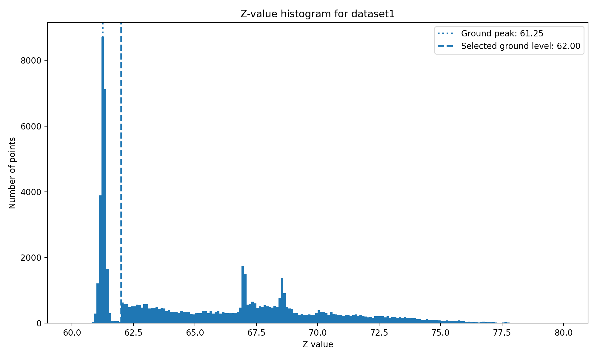
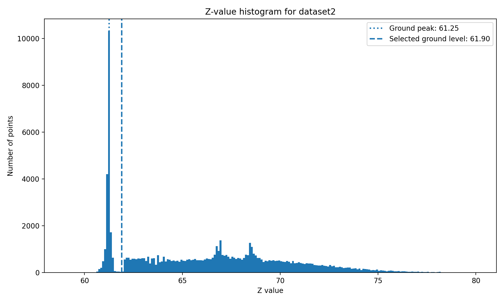

# LiDAR Ground Level Estimation


## Method

This project estimates the ground level in two LiDAR point-cloud datasets. Each dataset is stored as a NumPy array where each row contains three values: `x`, `y` and `z`.

The estimation is based on the `z`-values. A histogram is created for each dataset to show how the height values are distributed. The largest peak in the histogram represents the main ground surface. After that peak, the first clear valley is selected as the ground level cutoff. This separates the ground points from the points above the ground.

The script loads both datasets from the `data` folder, estimates the ground level, prints the result, and saves the histogram plots in the `images` folder.

## Results

| Dataset | Selected ground level | Points above ground |
|---|---:|---:|
| `dataset1.npy` | 62.00 | 48,605 / 72,067 |
| `dataset2.npy` | 61.90 | 65,550 / 84,588 |

The result shows that the estimated ground level is close for both datasets, around `62`. This is expected because both point clouds have a strong concentration of points around the same height level.

## Plots

The plots below show the distribution of the `z`-values for each dataset. The dotted line marks the strongest ground peak, and the dashed line marks the selected ground level cutoff.

### Dataset 1



### Dataset 2



## How to run

Install the required Python packages:

```bash
pip install -r requirements.txt
```

Run the script:

```bash
python share.py
```